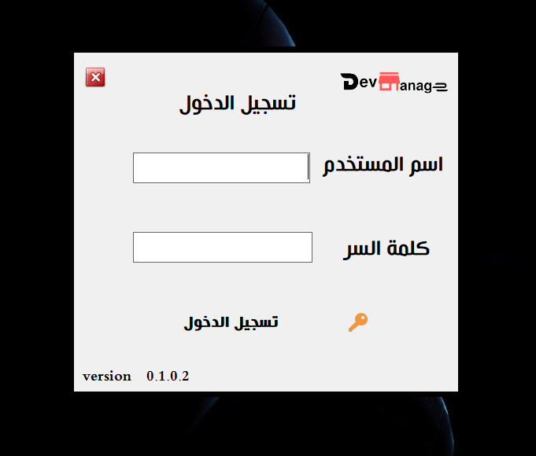
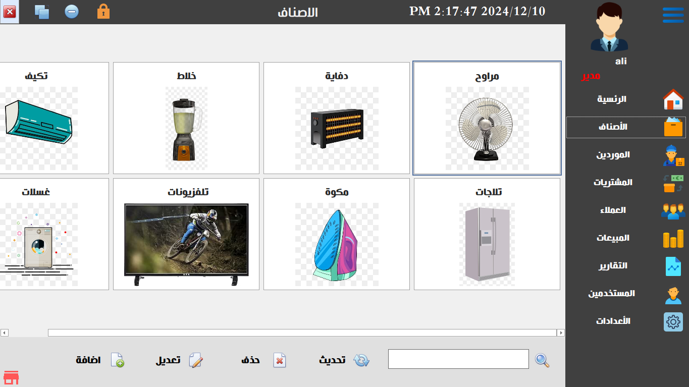
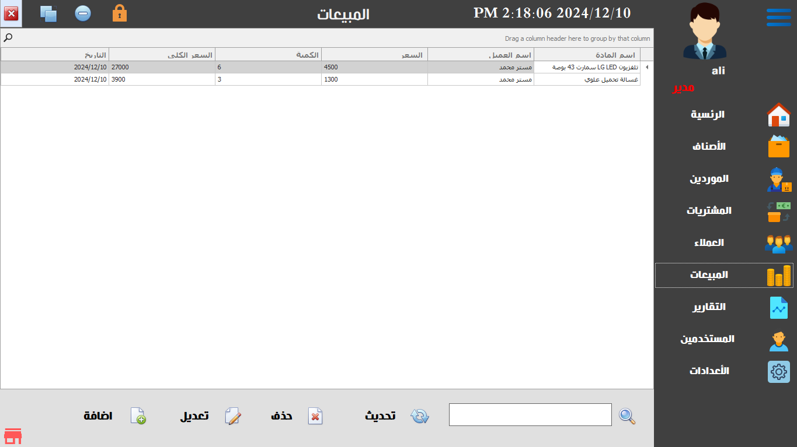
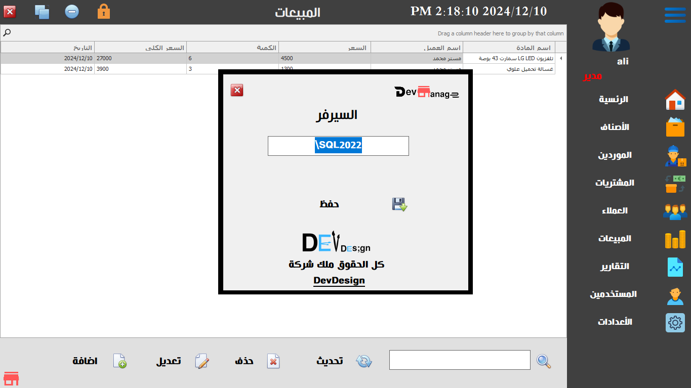
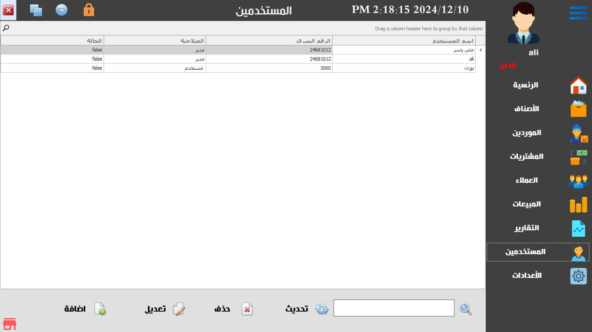
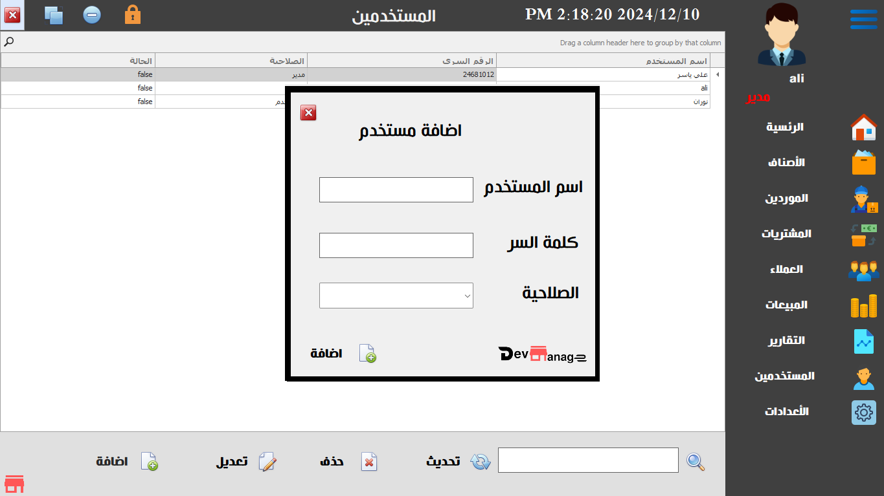
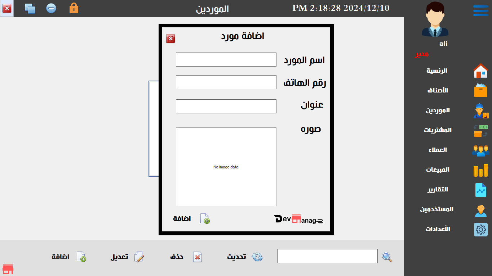
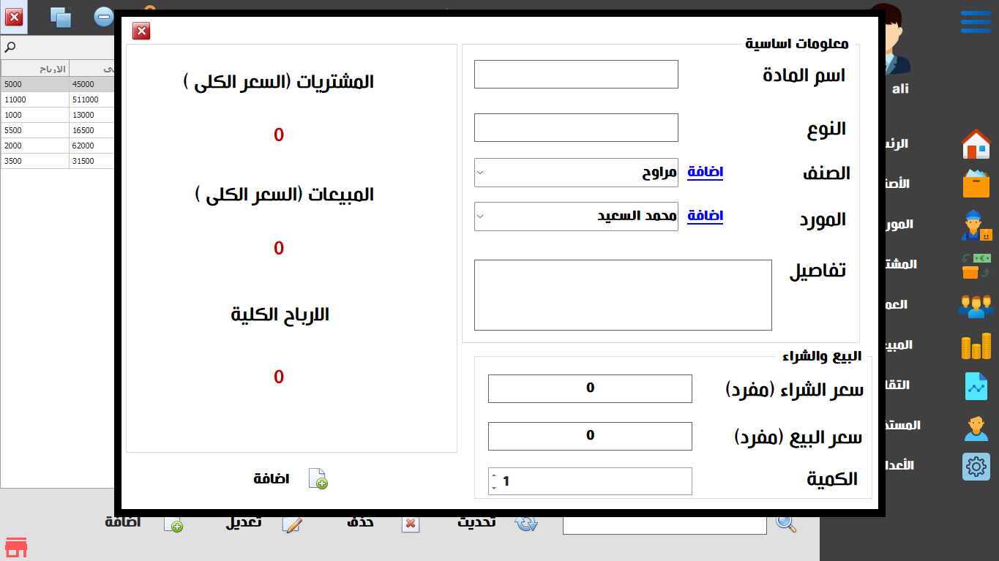
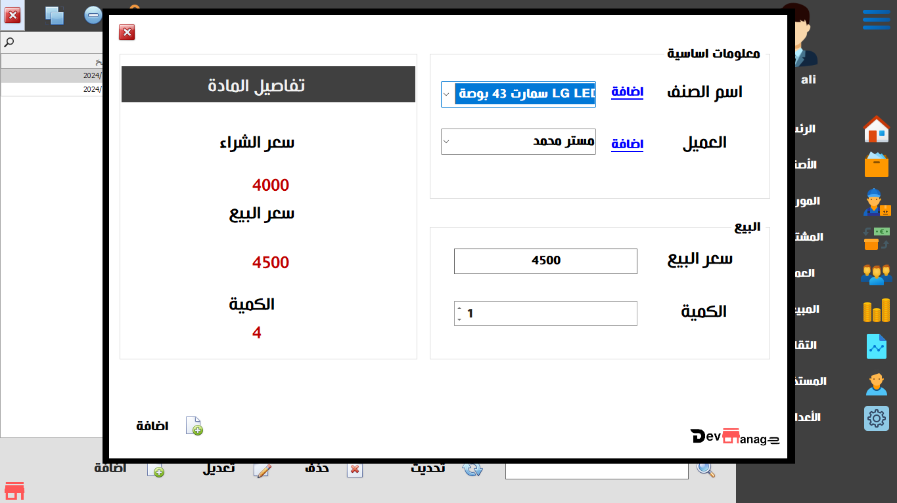

# DevManage 📦

A powerful desktop inventory management system designed for **warehouses and retail stores**, developed using **C# Windows Forms**.  
It helps businesses track stock levels, manage suppliers, and streamline inventory operations with ease.

---

## 🧾 Introduction

**DevManage** is a complete inventory control system tailored for small to medium businesses.  
Built for **efficiency**, **accuracy**, and **multi-user environments**, it simplifies stock management and ensures full visibility of your inventory.

---

## 🛠️ Technologies Used

- 💻 C# Windows Forms (.NET Framework)
- 🗄️ SQL Server for secure data storage

---

## 🚀 Who is this for?

- Warehouses & stores needing inventory tracking
- Businesses managing products, suppliers, and stock movement
- Teams requiring secure, multi-user access

---

## ✅ Problems It Solves

- Manual stock tracking and human errors
- Difficulty identifying stock shortages or overstock
- Lack of real-time inventory visibility
- Uncontrolled user access to sensitive data

---

## 🌟 Features

- 📦 Inventory & Product Management
- 🧾 Invoice and Purchase Order Tracking
- 👥 Multi-user Roles & Secure Login
- 📊 Real-time Stock Overview and Reports
- 📑 Supplier & Category Management

---

## 📸 Program Screenshots

### 🔐 Login Screen  

### 🏠 Home Screen  

### 📊 Dashboard Overview  

### 📊 Dashboard Overview  

### 📊 Dashboard Overview 

### 📊 Dashboard Overview 

### 🧾 Warehouse View    

### 📊 Inventory Analytics  

### 📊 Dashboard Overview  

### 📊 Dashboard Overview 

### 📊 Dashboard Overview

---

## 🛑 Source Code

The source code is **not publicly available** in order to protect the developer’s intellectual property.

---

## 📩 Request a Demo Version

To get a trial or customized version for your business, contact us directly via WhatsApp:

> 📌 *Please mention your name, company, and desired features in your message.*

---

### 👨‍💻 Developed with ❤️ by Ali Eid
